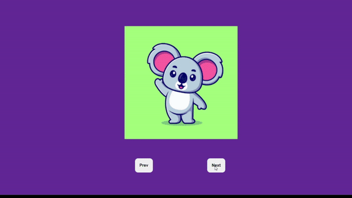

# Rotating 3D Cube
A simple 3D rotating cube built with HTML, CSS, and JavaScript. This project demonstrates the use of CSS animations and 3D transforms to create an interactive and visually appealing effect.

# Preview

Example of the rotating 3D cube in action.

# Features
1. Smooth 3D rotation using JS
2. Lightweight  design.
